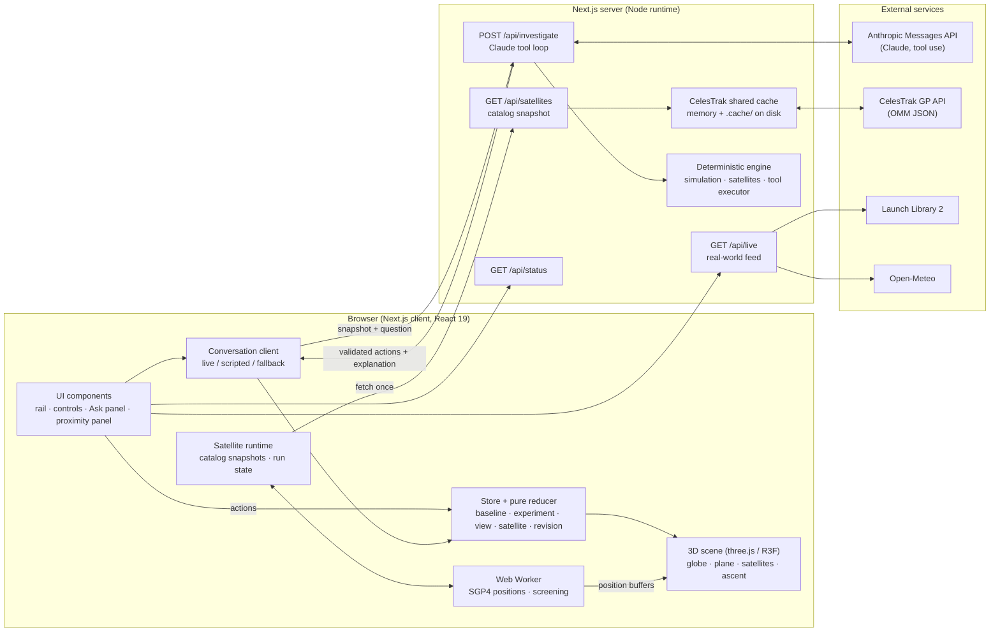
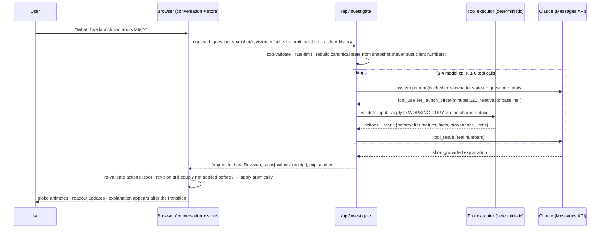
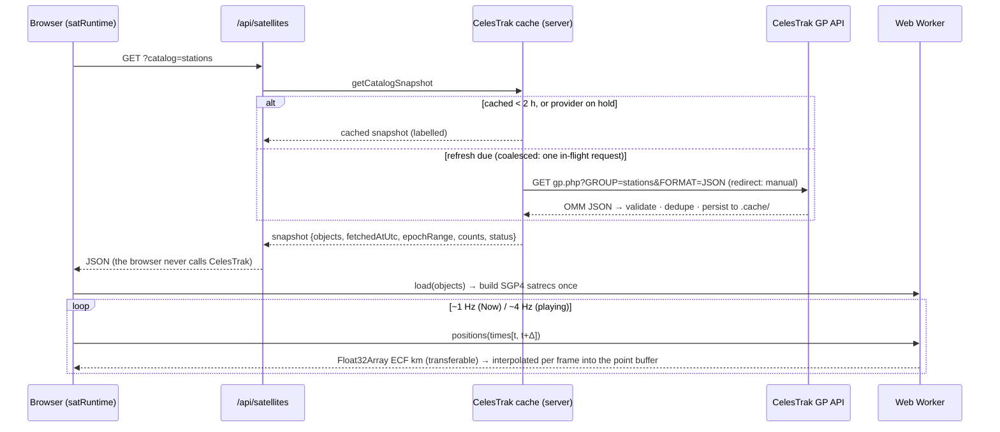

# AstroRipple — System Design

A mid/high‑level map of how AstroRipple works: components, data flows, APIs, and the design
decisions behind them. For the science, see [SIMULATION.md](SIMULATION.md) (orbital geometry and
weather) and [SATELLITES.md](SATELLITES.md) (orbital data, SGP4, screening). For what users see, see
[GUIDE.md](GUIDE.md).

---

## 1 · The idea in one diagram

```
question / control ──▶ validated action ──▶ deterministic calculation ──▶ 3D change ──▶ grounded explanation
```

Four "drivers" can change the scene: **manual controls**, the **AI** (Claude), the **scripted**
no‑key fallback, and the **guided tours**. All four go through **one deterministic engine and one
reducer**. The AI never computes numbers or edits the scene directly. It *chooses tools*, the engine
computes, and the browser applies the resulting actions exactly as if the user had clicked them.

---

## 2 · System overview



### Layers (code map)

| Layer | Path | Responsibility | Depends on |
|---|---|---|---|
| **Simulation core** | `src/simulation/` | Frames, Earth rotation, orbital planes, site‑to‑plane angle, weather heuristic, scenario transforms, metrics. | nothing (pure TS) |
| **Satellite science** | `src/satellites/` | UTC parsing, OMM validation, catalogs, SGP4 + frames, ascent, screening, synthetic objects, best‑view planner. | `satellite.js` |
| **State** | `src/state/` | Pure reducer (single source of truth), store, remote‑action acceptance, conversation, satellite runtime, run bookkeeping. | simulation, satellites |
| **AI** | `src/ai/` | Tool schemas (zod + JSON Schema), deterministic tool executor, protocol, system prompt, scripted fallback. | state, simulation, satellites |
| **Rendering** | `src/render/`, `src/components/GlobeScene.tsx`, `components/satellite/SatelliteLayer.tsx` | three.js scene graph; the single sim→three coordinate adapter. | state |
| **UI** | `src/components/` | React components; dispatch actions, read derived metrics. | state, AI client |
| **Server** | `src/app/api/*`, `src/satellites/server/` | Claude loop, catalog cache, optional real‑world feed. | engine, external APIs |

The simulation and satellite modules are **pure and isomorphic**: the same code runs in the browser,
the Web Worker, the server tool loop and the tests.

---

## 3 · State model

```
InvestigationState  (pure reducer, src/state/reducer.ts)
├─ mission          fictional Detective-1: windows, weather fixture anchor
├─ baseline         Scenario — immutable during an investigation
├─ experiment       Scenario — the only thing tools/controls mutate
├─ undoStack        previous experiments
├─ revision         increments on every meaningful change → staleness guard
├─ view             compare/single, focus, highlight, playback offset & speed, prefs
├─ satellite        enabled, timeSource now|scenario, catalogId, selection, threshold,
│                   syncMode, horizon filter, screeningNonce, focused encounter
└─ appliedRequestIds  de-duplicates AI responses
```

Heavy or high‑frequency data is deliberately kept **outside** the reducer:

| Store | Holds | Why separate |
|---|---|---|
| `liveClock` (mutable) | per‑frame playback position, speed | 60 fps updates must not re‑render React |
| `conversation` | Q&A log, AI availability | describes the talk, never the geometry |
| `satRuntime` | catalog snapshots, worker handle, run results, position buffers | large and async; results are keyed to their inputs |

A **Scenario** is `{ launchTimeUtc, launchSiteId, orbitPreset, inclinationDeg, ascendingNodeDeg,
altitudeKm, revision }`. Every display number comes from `computeMetrics(scenario, …)`. The readout,
HUD, tool results and AI explanation therefore always agree.

---

## 4 · Key flows

### 4.1 Asking the AI a question



If the user changed the scenario while waiting, the revision differs, so the answer is **discarded
and labelled stale** rather than shown against the wrong state. Without an API key, or if the AI
fails, the **scripted** path matches the question to tools, runs the *same executor* in the browser,
and fills explanation templates from the real results.

### 4.2 Satellite Mode: loading data



### 4.3 Satellite Mode: screening a launch

```
Analyze ─▶ reducer SAT_REQUEST_SCREENING (nonce++)
        ─▶ ScreeningController: inputsKey = epochs · snapshotId · threshold · trajectory
        ─▶ worker.screen(runId, baseline + experiment)      (chunked, yields → cancellable, progress)
              for each object: age gate → (radial bound if >500) → 2 s coarse samples
                               → golden-section refinement of local minima → events ≤ threshold
        ─▶ result accepted only if runId is current; shown as "current" only if inputsKey still matches
```

AI tools compute the same screening synchronously on the server, against the **same catalog
snapshot** the browser loaded (matched by `snapshotId`). Their result text and the browser's worker
result are therefore identical.

---

### 4.4 Best view (where to watch)

```
◉ Best view / "Where should I watch from?" ─▶ reducer SET_VIEWING (camera focus = 'viewing')
  computeViewingPlan(experiment, mission)                      pure, cached per scenario, ~10–25 ms
    launch azimuth from the target inclination ─▶ illustrative ascent from that site (T+0–540 s)
    ~144 candidate spots, 15–150 km, kept only if on land  (Natural Earth 1:110m, bundled)
    score = side-on view (sin of angle between line of sight and flight) · peak elevation comfort (20–45°)
            · time above 5° · closeness
    weather rating = demo cloud/rain at that launch time; clearest supplied window
  ─▶ ViewingLayer (visible stretch, spot, line of sight) · drone-view camera · ViewingCard
```

The AI tool `show_best_viewing` returns the same plan, so its answer and the on‑screen card match.

## 5 · APIs

### Internal (Next.js route handlers)

| Route | Method | Purpose | Input → Output | Guards |
|---|---|---|---|---|
| `/api/investigate` | POST | Claude tool loop | `{requestId, question, snapshot, history}` → `{requestId, baseRevision, steps[], explanation}` | zod schema, 20 req/min/IP, ≤4 model calls, ≤6 tool calls, result/explanation size caps, 503 when no key |
| `/api/satellites` | GET | Catalog snapshot | `?catalog=stations\|active-sample\|active-leo\|synthetic-demo` → `CatalogSnapshot` | allow‑list, 30 req/min/IP, shared cache |
| `/api/live` | GET | Optional real‑world feed | → launches + Florida weather assessment | off unless `LD_ENABLE_LIVE_DATA=1`; 30 min / 15 min server cache |
| `/api/status` | GET | AI availability | → `{ai: boolean, model?, liveData}` | never exposes the key |

### External

| Service | Used for | Auth | How we call it | Failure behaviour |
|---|---|---|---|---|
| **Anthropic Messages API** (`@anthropic-ai/sdk`) | Live AI: tool selection + grounded explanation | `ANTHROPIC_API_KEY`, server‑side only | beta messages with tools, cached system prompt, `effort` low by default, server‑side refusal fallback on supported models | the scripted fallback answers instead; the scene is never left half‑changed |
| **CelesTrak GP** (`celestrak.org/NORAD/elements/gp.php`) | Real orbital elements (OMM JSON) for `stations` and `active` | none | server only; ≥ 2 h between downloads per group; coalesced; persisted; `redirect: manual` | any non‑200, redirect or timeout → 2 h hold, error shown, labelled cache or bundled fixture served |
| **Launch Library 2** (The Space Devs) | Upcoming real launches (optional card) | none (free tier) | server, 30 min cache | "schedule unavailable"; the demo is unaffected |
| **Open‑Meteo** | Current Florida forecast (optional card) | none | server, 15 min cache | "unavailable"; the demo is unaffected |
| **Natural Earth / world‑atlas** | Coastlines for the Earth texture | bundled npm package | drawn locally into a canvas texture | n/a (offline) |

### Libraries

| Library | Why |
|---|---|
| Next.js 16 (Turbopack), React 19 | App framework, API routes, single deployable |
| three.js + @react-three/fiber + drei | WebGL globe, declarative scene graph, HTML labels |
| satellite.js 7 | Official SGP4/SDP4 implementation (pure JS path; WASM runtimes aliased out) |
| zod 4 | Validation authority for tool inputs, API requests and remote actions |
| @anthropic-ai/sdk | Typed Claude client |
| vitest | Unit and integration tests (Node environment) |

---

## 6 · Rendering design

- **Two frames, two groups.** The *inertial* root holds the target plane, orbit and angle annotation.
  The *Earth‑fixed* group (rotated by θ(t) ≈ GMST) holds the Earth mesh, launch site, satellites and
  ascent. A delay rotates only the Earth group, so the plane cannot accidentally rotate with Earth.
- **One adapter.** `render/frameAdapter.ts` is the only place simulation axes (z‑up) map to three.js
  axes (y‑up), and km map to scene units. Scientific code never touches scene units.
- **Satellites as one point buffer** (not one component each). Positions come from the worker, are
  interpolated between two instants for smooth motion, and are never reused for screening.
  Highlighted objects get a second small buffer and HTML labels.
- **Transitions.** Canonical state changes instantly. The displayed geometry eases toward it over
  ~1.2 s, and labels are computed from the *displayed* geometry, so text and picture always match.
  Answers are revealed when the animation lands.
- **Fallbacks.** No WebGL → 2D schematic. Reduced‑motion → instant changes, no camera flights.

---

## 7 · Design decisions & trade‑offs

| # | Decision | Why | Trade‑off |
|---|---|---|---|
| 1 | **The AI acts only through a small set of typed tools** (16) executed by deterministic code | Numbers can't be hallucinated; every AI action has a manual twin; easy to test | Less open‑ended than a free‑form chatbot |
| 2 | **One reducer for every driver** (manual, AI, scripted, tour) | Identical state whatever the source; tests check manual ≡ AI | Every feature must be expressed as actions |
| 3 | **Server rebuilds state from a compact snapshot** | Never trust client‑sent geometry; the request stays small | Snapshot schema must evolve with features |
| 4 | **Revision + requestId staleness checks** | Late AI answers or worker results can't overwrite a newer experiment | Users occasionally see "discarded, ask again" |
| 5 | **Immutable baseline, mutable experiment** | Every number is a comparison against the original plan | Only one experiment at a time (plus ≤3 offsets in AI comparisons) |
| 6 | **Frozen target plane; GMST‑aligned frame** | Teaches the real effect of timing; consistent with satellite positions | No precession or phasing (documented) |
| 7 | **Illustrative Earth‑fixed ascent; a delay re‑flies the same path** | Encounter screening needs a time‑parameterised trajectory; the delay model is honest and simple | Does not show the delayed mission is achievable (labelled) |
| 8 | **Screening in a Web Worker**, coarse 2 s + golden‑section refinement | UI stays responsive; fast encounters between samples are recovered | Minima closer together than ~2 s can merge (documented) |
| 9 | **CelesTrak only via a shared server cache** | Respects the provider policy (download once per ~2 h update); one download serves all users | Needs a shared store (KV/Redis) for multi‑instance or serverless deployment |
| 10 | **Bundled, epoch‑labelled fixtures + synthetic demo** | The demo works fully offline; a constructed example is guaranteed to show an encounter | Fixture elements age (flagged after 3 days, excluded after 14) |
| 11 | **Honesty as a feature**: provenance tags, "estimated", no collision probability | Educational integrity; judges can trust the numbers | More qualifying language (kept behind ⓘ where possible) |
| 12 | **Progressive‑disclosure UI** | Clean first impression; details one click away | Some facts need a click |
| 13 | **satellite.js WASM runtimes aliased to a stub** | Their self‑referencing pthread worker hung the Turbopack build; pure JS is fast enough (~3 µs per propagation) | No WASM bulk propagation |
| 14 | **Best view = geometry + demo weather, on land only** | Explainable score (side‑on, comfortable elevation, time in view, closeness); runs synchronously everywhere | Coarse coastline; no daylight, terrain or access modelling (labelled) |

---

## 8 · Reliability, security, performance

**Security**
- The API key stays server‑side and is never sent to the browser.
- Every external input is validated with zod: requests, tool inputs, remote actions and catalog ids.
- Tool loops are capped, and routes are rate‑limited per IP.
- Prompt‑injection containment: user text and tool results are wrapped as *data* (`<scenario_state>`,
  `<question>`). The system prompt states they cannot change the rules. The browser re‑validates and
  applies actions atomically.

**Reliability**
- Each failure falls back to a labelled lower tier: live AI → scripted; live data → cache → fixture;
  WebGL → schematic; Worker → in‑thread engine.
- Upstream errors trigger a hold instead of retries.

**Performance (measured)**
- SGP4 costs ~3 µs per propagation.
- Screening the 250‑object sample for baseline + experiment takes ~1 s in the worker, UI included.
- Display positions update at 1–4 Hz and are interpolated per frame. Propagators are built once per snapshot.

**Testing**
- 120 vitest tests, plus a browser smoke script driven over CDP.
- What they cover:
  - SGP4 against Vallado's published reference case;
  - UTC parsing, frames and units;
  - screening edge cases: refinement, endpoints, multiple minima, crossing paths, altitude;
  - stale results and cancellation;
  - the cache policy (coalescing, hold, no redirects);
  - manual ≡ AI parity;
  - the route with a mocked SDK.

---

## 9 · Deployment

```bash
npm install && npm run build && npm start      # single Node process, port 3000
```

| Env var | Effect |
|---|---|
| `ANTHROPIC_API_KEY` | Enables live Claude (otherwise scripted mode) |
| `ANTHROPIC_MODEL`, `LD_AI_EFFORT` | Model id (default `claude-opus-5-5`), effort low/medium/high |
| `LD_ENABLE_LIVE_DATA=1` | Enables the real‑world feed card |
| `LD_SATELLITE_SOURCE=fixture` | Never contact CelesTrak (offline demo) |
| `LD_SATELLITE_CACHE_DIR` | Where the CelesTrak cache persists (default `.cache/celestrak`) |

On a single server, the in‑memory plus on‑disk cache is enough. For serverless or several
instances, back the CelesTrak cache with a shared store, and replace the in‑memory rate limiter.

---

## 10 · Limits and next steps

**Not modelled (by design, and labelled in the app):**
- vehicle performance, real trajectories, orbital phasing, nodal precession;
- launch‑commit criteria;
- post‑insertion flight;
- collision probability (needs covariance) and relative speeds;
- optical visibility.

**Natural next steps:**
- per‑site ascents;
- a published‑trajectory import (fixed ephemeris, no time‑shifting);
- covariance‑aware risk with real conjunction data (e.g. CDMs), clearly separated from the teaching mode;
- shareable URL state;
- daylight‑ and terrain‑aware viewing (the current Best view is geometry + demo weather).
