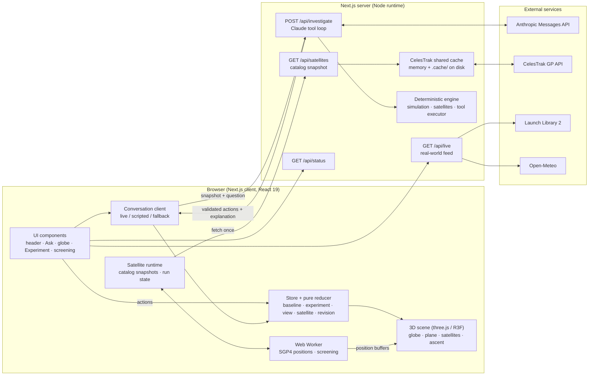
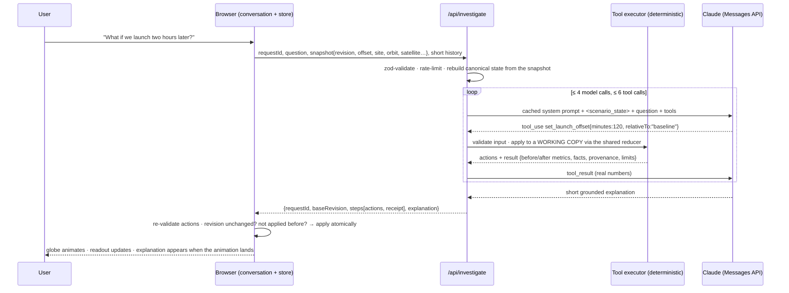

# OrbitStudio — System Design

OrbitStudio is an educational "what if?" explorer for a rocket launch. You change one thing (the
launch time, the orbit, the launch site), and the app recomputes the consequence, shows it on a 3D
globe next to the untouched original plan, and explains it from the actual calculation. Satellite
Mode adds real cataloged satellites and screens an illustrative ascent against them.

This document is the single reference for **how the system is built and why**, **how every number on
screen is calculated**, and **where each piece of data comes from** (real, cached, or fictional).
For a feature tour, see [GUIDE.md](GUIDE.md); for satellite-screening minutiae (record validation,
event fields, run lifecycle), see [SATELLITES.md](SATELLITES.md).

**Contents**
1. [The idea](#1--the-idea)
2. [Where every number comes from](#2--where-every-number-comes-from)
3. [Architecture](#3--architecture)
4. [Calculations](#4--calculations)
5. [Data sources in detail](#5--data-sources-in-detail)
6. [Real time vs. simulated time](#6--real-time-vs-simulated-time)
7. [Key flows](#7--key-flows)
8. [Design decisions and trade-offs](#8--design-decisions-and-trade-offs)
9. [APIs](#9--apis)
10. [Reliability, security, performance](#10--reliability-security-performance)
11. [Configuration and deployment](#11--configuration-and-deployment)
12. [Testing](#12--testing)
13. [Limits and next steps](#13--limits-and-next-steps)

---

## 1 · The idea

```
question / control ──▶ validated action ──▶ deterministic calculation ──▶ 3D change ──▶ grounded explanation
```

Four "drivers" can change the scene: the **manual controls**, the **AI** (Claude), the **scripted**
no-key fallback, and the **guided tours**. All four go through **one deterministic engine and one
reducer**. The AI never computes numbers or edits the scene directly: it *chooses tools*, the engine
computes, and the browser applies the resulting actions exactly as if the user had clicked them.

Every comparison is **baseline vs. experiment**: the baseline is the original plan and never changes
during an investigation; every control and tool edits only the experiment copy.

---

## 2 · Where every number comes from

| Data on screen | Comes from | Real or fictional | Freshness | Code |
|---|---|---|---|---|
| Launch windows A and B | Generated in the browser at load (A = next 21:45 UTC at least 2 h away, B = A + 3 h) | **Fictional** (DEMO) | Fixed for the session | `src/data/demoMission.ts` |
| Countdown | Your device clock vs. the next window | Real clock, fictional target | Ticks every second | `src/state/clock.ts` |
| Launch sites | Three curated, approximate coordinates | Approximate real places | Static | `src/data/demoMission.ts` |
| Mission weather (gusts, rain, cloud, wind) | Hourly fixture defined relative to Window A | **Fictional** (DEMO) | Static | `src/data/demoMission.ts` |
| Weather light (green/yellow/red) | Computed from the fixture with teaching thresholds | Computed | On every change | `src/simulation/weather.ts` |
| Target orbital planes | Constructed from three presets so each plane passes over the site at the baseline time | Illustrative | On orbit change | `src/simulation/orbits.ts`, `scenario.ts` |
| Earth rotation, site-to-plane angle | Computed (sidereal rate, GMST-aligned frame) | Computed | On every change / playback frame | `src/simulation/coordinates.ts`, `metrics.ts` |
| Best view (where to watch) | Computed from the illustrative ascent, a coastline land mask and the demo weather | Computed | Per scenario, cached | `src/satellites/viewing.ts` |
| Cataloged satellites | **CelesTrak GP data** (OMM JSON) through a shared server cache; bundled snapshot offline | **Real** public orbital elements | At most once per ~2 h per group | `src/satellites/server/celestrakCache.ts` |
| Satellite positions | SGP4 propagation of those elements (satellite.js) | Estimated, not telemetry | ~1 Hz ("Now") / ~4 Hz (playback), interpolated per frame | `src/satellites/propagation.ts` |
| Rocket ascent | Analytic profile | **Illustrative** | Static | `src/satellites/ascent.ts` |
| Close approaches | Screening: rocket vs. every screened object at the same instants | Computed | On "Analyze" | `src/satellites/screening.ts` |
| SYN-A … SYN-D | Constructed around the ascent at a fixed demonstration time | **Fictional** | Static | `src/satellites/synthetic.ts` |
| Upcoming real launches | **Launch Library 2** (The Space Devs) | **Real** | Server cache 30 min, fetched on "Load" | `src/data/launchAdapter.ts` |
| Current Florida weather | **Open-Meteo** forecast API | **Real** | Server cache 15 min, fetched on "Load" | `src/data/weatherAdapter.ts` |
| Coastlines and land test | **Natural Earth** 1:110m via `world-atlas` (bundled) | Real (coarse) | Static | `src/render/earthTexture.ts`, `src/simulation/landMask.ts` |
| Explanations | Claude choosing tools (live) or templates filled from tool results (scripted) | Generated from computed results only | Per question | `src/app/api/investigate/`, `src/ai/` |

Provenance is visible in the app: **DEMO** (fictional fixture), **LIVE** (fetched now), **CACHED**
(recent copy), **COMPUTED**, **FIXTURE** (bundled snapshot), **SYNTHETIC** (fictional objects). The
real-world feed is kept in its own card and is never attached to the fictional mission.

---

## 3 · Architecture



### Layers

| Layer | Path | Responsibility | Depends on |
|---|---|---|---|
| Simulation core | `src/simulation/` | Frame, Earth rotation, orbital planes, site-to-plane angle, weather heuristic, scenario transforms, metrics, land mask | nothing (pure TS) |
| Satellite science | `src/satellites/` | UTC parsing, OMM validation, catalogs, SGP4 and frames, ascent, screening, synthetic objects, best-view planner | `satellite.js` |
| State | `src/state/` | Pure reducer (single source of truth), store, remote-action acceptance, conversation, satellite runtime | simulation, satellites |
| AI | `src/ai/` | Tool schemas (zod + JSON Schema), deterministic tool executor, protocol, system prompt, scripted fallback, answer formatting | state, simulation, satellites |
| Rendering | `src/render/`, `GlobeScene.tsx`, `SceneHtml.tsx`, `satellite/SatelliteLayer.tsx`, `ViewingLayer.tsx` | three.js scene graph, the single sim→three coordinate adapter, screen-space labels | state |
| UI | `src/components/` | React components; dispatch actions, read derived metrics | state, AI client |
| Server | `src/app/api/*`, `src/satellites/server/`, `src/data/*Adapter.ts` | Claude loop, catalog cache, optional real-world feed | engine, external APIs |

The simulation and satellite modules are **pure and isomorphic**: the same code runs in the
browser, the Web Worker, the server tool loop and the tests.

### State model

```
InvestigationState  (pure reducer, src/state/reducer.ts)
├─ mission          fictional demo mission: windows, weather fixture anchor
├─ baseline         Scenario — immutable during an investigation
├─ experiment       Scenario — the only thing tools and controls change
├─ undoStack        previous experiments
├─ revision         increments on every meaningful change → staleness guard
├─ view             compare/single, focus, highlight, playback offset and speed, preferences
├─ satellite        enabled, time source, catalog, selection, threshold, sync mode, filters, focus
└─ appliedRequestIds  de-duplicates AI responses
```

A **Scenario** is `{ launchTimeUtc, launchSiteId, orbitPreset, inclinationDeg, ascendingNodeDeg,
altitudeKm, revision }`. Every displayed number comes from `computeMetrics(scenario, …)`, so the
readout, globe annotations, tool results and AI explanations always agree.

High-frequency or heavy data lives **outside** the reducer: `liveClock` (per-frame playback
position, so 60 fps never re-renders React), `conversation` (the Q&A log), and `satRuntime`
(catalog snapshots, worker handle, screening results keyed to their inputs).

### Screen layout

A "mission console": the **header** carries the brand, the countdown and both windows' weather
lights; below it three columns share the viewport height — **Ask** (left), the **3D globe** with its
transport bar docked underneath (centre), and the **Experiment** controls with the baseline →
experiment readout at their foot (right). On narrow screens the columns stack globe → Experiment →
Ask. Explanations sit behind hover descriptions and ⓘ buttons rather than on the main surface.

---

## 4 · Calculations

All scientific code is pure TypeScript. Numbers are computed in full precision and rounded only for
display.

### 4.1 Frame and Earth rotation

- **Demo inertial frame** ("ECI-like"): right-handed, +z through the geographic north pole,
  east-positive longitude, spherical Earth of unit radius for geometry.
- **Earth rotation angle:** θ(t) = θ₀ + ω · (t − t₀), with ω = 7.292115 × 10⁻⁵ rad/s (sidereal rate),
  t₀ = 2026-01-01T00:00:00Z and θ₀ = GMST(t₀) = 1.756863 rad (from satellite.js `gstime`). θ(t)
  therefore tracks Greenwich Mean Sidereal Time to within ~0.016° over 2026, which keeps the globe
  consistent with propagated satellites. Precession, nutation, polar motion and UT1−UTC are not modelled.
- **Earth turns** (readout) = ω · Δt between the baseline and experiment launch times:
  ≈ 15.04° per hour, so +2 h → 30.08°.

### 4.2 Launch site direction

r_fixed = [cos φ cos λ, cos φ sin λ, sin φ] (latitude φ, longitude λ); its inertial direction at
time t is r = R_z(θ(t)) · r_fixed.

| Site | Latitude | Longitude | Note |
|---|---|---|---|
| Florida coast (near Cape Canaveral) | 28.49° N | 80.58° W | Mission default; the only site with demo weather and a screening ascent |
| California coast (near Vandenberg) | 34.63° N | 120.61° W | Approximate |
| French Guiana coast (near Kourou) | 5.24° N | 52.77° W | Approximate |

### 4.3 Target orbital plane

- A plane with inclination *i* and ascending node Ω has the unit normal
  **n** = [sin i sin Ω, −sin i cos Ω, cos i]. In-plane basis: e₁ = [cos Ω, sin Ω, 0] (towards the
  ascending node), e₂ = n × e₁, so motion e₁ → e₂ is prograde when n_z > 0, retrograde when n_z < 0.
- **Construction (a deliberate teaching example):** for each preset, Ω is solved so the mission's
  site lies in the plane at the **baseline** launch time on an ascending pass:
  sin u = sin φ / sin i, Ω = λ_inertial − atan2(cos i · sin u, cos u).
- **Frozen plane:** changing the launch time never moves the plane. Changing the preset rebuilds
  the plane from the *baseline* time (a delay is never silently retargeted). Changing the site keeps
  the plane.

| Preset | Inclination | Drawn altitude | Direction |
|---|---|---|---|
| Inclined LEO example | 45.1° | 500 km | prograde |
| Polar example | 90° | 500 km | polar |
| SSO-like example | 98.1° | 700 km | retrograde (sun-synchronicity itself needs J2 precession, not simulated) |

The drawn orbit exaggerates altitude ×3 for visibility. The satellite marker on the orbit shows the
direction of motion only (phase is not modelled; it starts at the ascending node and advances with
the circular period 2π√(a³/μ), μ = 398 600.4418 km³/s²).

### 4.4 Site-to-plane angle

δ = asin(clamp(|n · r|, 0, 1)), in degrees: the geometric angle between the launch site's direction
and the target plane, evaluated at the displayed instant (launch time + playback offset). 0° means the
plane passes directly overhead. Inputs are normalised and clamped, so the result is never NaN. It is
**not** a steering angle, a fuel cost or a feasibility verdict.

Earth rotation and δ are usually different numbers, because the site moves along its latitude circle
and the plane is tilted. Florida, inclined plane: +2 h → Earth turns 30.08°, δ = 12.5°; +3 h → 45.1°
vs. 15.8°. Polar plane, +2 h → δ = 26.1°.

The **curve behind the timing slider** samples δ every 10 minutes across ±12 h against the frozen
plane. It shows when the site crosses the plane; it is not a list of launch windows.

### 4.5 The readout (baseline → experiment)

| Row | Formula |
|---|---|
| Shift | experiment launch − baseline launch, in minutes (shown as ±h min) |
| Earth turns | ω · shift (signed, degrees) |
| ∠ Site–plane | δ for the baseline → δ for the experiment (§4.4) |
| Weather | weather light at each scenario's launch time (§4.6) |

### 4.6 Weather light

The light is a **teaching heuristic**, not launch-commit criteria and not a probability of approval.

| Light | Rule |
|---|---|
| **Red** | gusts ≥ 50 km/h **or** precipitation probability ≥ 70 % |
| **Yellow** | not red **and** (gusts ≥ 30 km/h **or** precipitation probability ≥ 40 % **or** cloud cover ≥ 70 %) |
| **Green** | all required fields present and below every yellow threshold |
| **Unknown** | a required field (gusts, precipitation probability, cloud cover) is missing, or the time is outside the forecast |

- **Time matching:** the launch time is rounded to the nearest whole hour and that hourly row is used;
  the forecast hour is shown with the evidence. Weather is evaluated at **launch time**, not at the
  playback instant.
- **Every reason is listed** (e.g. "Gusts 36 km/h ≥ 30 km/h (yellow threshold)"), and the cells that
  triggered the rule are highlighted in the popover.
- **Viewing note (separate, never a safety signal):** cloud ≥ 70 % → little of the ascent visible;
  40–69 % → partial viewing; < 40 % → good viewing.
- The same rules are applied to the real Open-Meteo forecast in the real-world feed.

**The demo forecast** (Florida only; other sites have no demo weather and read "Unknown"). Rows are
hours after the UTC hour containing Window A (with Window A at 21:45 UTC, row 0 = 21:00 UTC):

| Row | Gusts km/h | Wind km/h | Rain % | Cloud % | Light | Note |
|---|---|---|---|---|---|---|
| −6 … −2 | 18–28 | 10–16 | 5–15 | 20–45 | Green | |
| −1, 0 | 31, 34 | 18, 20 | 20 | 50, 55 | Yellow | gusts |
| **+1** | **36** | 21 | 25 | 60 | **Yellow** | **Window A** (21:45 → 22:00) |
| +2 | 35 | 21 | 30 | 68 | Yellow | gusts — "two hours later" stays yellow |
| +3 | 33 | 19 | 35 | 74 | Yellow | gusts + cloud |
| **+4** | **22** | 13 | 15 | 38 | **Green** | **Window B** (00:45 → 01:00) |
| +5, +6 | 20, 24 | 12, 14 | 10, 15 | 30, 40 | Green | |
| +7, +8 | 32, 44 | 18, 26 | 45, 62 | 65, 85 | Yellow | |
| +9, +10 | 52, 58 | 31, 34 | 75, 80 | 95, 98 | **Red** | front passes |
| +11, +12 | 49, 38 | 29, 22 | 65, 40 | 90, 80 | Yellow | |
| +13, +14 | 29, 24 | 17, 14 | 25, 15 | 60, 45 | Green | |
| +15 | 20 | 12 | — | 35 | **Unknown** | deliberately missing field |
| outside −6 … +15 | | | | | Unknown | outside the forecast |

### 4.7 Countdown

Wall-clock countdown to the next supplied window, independent of every what-if. States: **upcoming**
(T−hh:mm:ss, days shown when > 24 h), **open** (time until the window closes), **tentative** (date
only for windows without an exact time) and **none**. It ticks locally every second.

### 4.8 Best view — where to watch

1. **Fly the illustrative ascent** (§4.10) from the scenario's site along the azimuth implied by the
   orbit: az = asin(cos i / cos φ) for prograde orbits; the southbound branch (180° − az) for polar
   and retrograde ones. Sampled every 5 s over T+0–540 s.
2. **Candidates:** 6 distances (15, 30, 50, 75, 110, 150 km) × 24 bearings (every 15°) = 144 spots,
   kept only if **on land** (Natural Earth 1:110m polygons, even-odd ray casting; coast accuracy is
   tens of km).
3. **Score** each spot from look angles to every ascent sample:
   score = 0.35 · side-on + 0.25 · comfort + 0.15 · (time above 5° / 540 s) + 0.25 · e^−(d − 15 km)/50 km
   - *side-on* = mean of sin(angle between line of sight and flight direction) while visible
     (1 = the whole arc seen from the side);
   - *comfort* = 1 for a peak elevation of 20–45°, falling linearly to 0 at the horizon and overhead.
4. **Report** the best spot's distance and bearing from the pad, where to look at T+60 s, the peak
   elevation and minutes above 5°.
5. **Viewing quality** from the demo weather at launch time: **Poor** if rain ≥ 40 % or cloud ≥ 70 %;
   **Fair** if cloud ≥ 30 %; otherwise **Good** ("No forecast" when unknown). The clearest supplied
   window is suggested when its cloud cover is at least 5 points lower.

Not modelled: daylight, plume brightness, terrain, roads, access and safety zones.

### 4.9 Satellite positions (Satellite Mode)

- **Propagation:** each CelesTrak record becomes a satellite.js satrec **once** per snapshot and is
  evaluated with SGP4 at absolute UTC instants. Tests reproduce Vallado's verification case 00005.
- **Frames:** SGP4 outputs TEME (km). Positions are rotated about +z by GMST (`gstime`, IAU-82) into
  the Earth-fixed frame (ECF) used for all comparisons. Polar motion and UT1−UTC (< 0.9 s, ≲ 0.5 km at
  LEO radius) are ignored — far smaller than public element uncertainty (kilometres, growing with age).
- **Validity:** positions below 80 km altitude count as failed (likely decayed); SGP4 error codes are
  counted per object and never crash a run.
- **Element age** (measured from each element epoch to the instant propagated): more than 3 days →
  flagged *stale*; more than 14 days → hidden and excluded from screening. Fetch time is not element age.
- **Display:** the worker returns positions for two instants (t and t + 1 s in "Now"; t and
  t + speed × 0.25 s while playing) and the scene interpolates every frame. Markers are enlarged and
  labelled "not to scale"; marker sizes are never used in calculations.
- **Above horizon** (display filter) uses look angles from a chosen site only; it is not optical visibility.

### 4.10 Illustrative ascent

A smooth, plausible profile — neither published nor flown:

- altitude h(t) = 230 · sin(πt / 1080)^1.4 km (≈ 69 km at T+150 s, 158 km at T+300 s, 230 km at T+540 s);
- downrange s(t) = 1404 · (0.25x² + 0.75x³) km with x = t / 540;
- flown from Florida (28.49° N, 80.58° W) on azimuth 53.4° for screening; converted from WGS-84
  geodetic to ECF; sampled every 10 s and evaluated with C¹ cubic Hermite interpolation; `null`
  outside T+0–540 s (no extrapolation).
- **Delay model:** a later launch re-flies the same Earth-fixed path at a later epoch. This is a
  controlled timing experiment; it does not re-solve the inertial target orbit, so it says nothing
  about whether the delayed mission is achievable (the app labels this).

### 4.11 Launch proximity screening

For each scenario's launch epoch t₀, elapsed time τ and object j:
separation(τ) = | rocket_ECF(τ) − sat_j,ECF(t₀ + τ) |, both at the same absolute instant.

1. **Age gate** at the run's start and end instants (§4.9).
2. **Radial bound** (only for sets larger than 500 objects): an object is cleared only if its radius
   range a(1 ∓ e) ± 50 km can never come within the threshold of the ascent's radius range.
3. **Coarse pass** every 2 s over T+0–540 s, endpoints included.
4. **Refinement:** every sampled local minimum within threshold + 16 km/s × step (plus each object's
   global coarse minimum) is refined by golden-section search on squared separation, to 0.01 s.
5. **Events:** refined minima at or below the screening distance (default 25 km, configurable
   1–200 km) are "potential close approaches". The distance is an illustrative flag, **not** a
   collision radius, and no collision probability is ever computed (that needs covariance data).

Both scenarios are screened in the Web Worker; the comparison reports each scenario's closest object,
the same-object change (closer / farther / similar, crossing the threshold or not), counts and
coverage differences. A cancelled or empty run is reported as "incomplete, no conclusion"; only a
complete run with no events shows "No approaches found within the selected distance, screened objects,
and time interval." Display rounding: one decimal below 10 km, whole kilometres above.

### 4.12 Synthetic encounter demonstration

Four fictional objects on analytic circular orbits (drag ignored), constructed against the ascent at a
fixed demonstration epoch, 2026-03-20 14:00 UTC:

| Object | Construction | Result (baseline / +10 min) |
|---|---|---|
| SYN-A | 3 km above the rocket at T+400 s | 3.0 km at T+400 s / 1,710 km |
| SYN-B | 12 km from the rocket at T+330 s if launch is +10 min | ~3,000 km / 12 km |
| SYN-C | crosses the T+250 s point 120 s after the rocket | 315 km — crossing paths at different times |
| SYN-D | same latitude/longitude as the rocket at T+300 s, 300 km higher | 299 km — same map spot, different altitude |

---

## 5 · Data sources in detail

### 5.1 Demo mission (local, fictional)

Generated in the browser at load (`buildDemoMission`): Window A opens at the next 21:45 UTC that is
at least 2 hours away (10-minute window); Window B opens 3 hours later (15-minute window, crossing
midnight UTC by design). Both are "exact" precision, so they get a seconds-level countdown. The
weather fixture is keyed to Window A (§4.6), which keeps the story consistent on any day: Window A is
yellow (gusts), Window B is green. The server can rebuild the identical mission from Window A's start
time, so AI tool calls run against exactly what the visitor sees.

### 5.2 CelesTrak GP (real satellites)

- **Endpoint:** `https://celestrak.org/NORAD/elements/gp.php?GROUP=<group>&FORMAT=JSON` (OMM JSON),
  groups `stations` and `active`. Fields used: `OBJECT_NAME, OBJECT_ID, NORAD_CAT_ID, EPOCH,
  MEAN_MOTION, ECCENTRICITY, INCLINATION, RA_OF_ASC_NODE, ARG_OF_PERICENTER, MEAN_ANOMALY, BSTAR,
  MEAN_MOTION_DOT, MEAN_MOTION_DDOT, EPHEMERIS_TYPE, CLASSIFICATION_TYPE, ELEMENT_SET_NO,
  REV_AT_EPOCH`. `EPOCH` (no zone suffix) is parsed as UTC; NORAD ids above 99999 are kept.
- **Validation:** records missing any SGP4 field are rejected with a reason (never filled in);
  duplicates are merged by NORAD id.
- **Screening sets:** *Stations* = the whole `stations` group (23 objects on 2026-10-03);
  *LEO sample · 250* = 250 objects evenly spaced by catalog number among LEO records of `active`
  (LEO = mean motion ≥ 11.25 rev/day and e < 0.25); *All active LEO* = every such record (~15.8k,
  heavier); *Synthetic demo* = SYN-A…D. Search and display filters never change the screening set.
- **Provider policy:** GP data updates about every two hours and should be downloaded once per
  update, so the browser never calls CelesTrak. The server keeps **one shared cache per group**
  (the two `active` sets share one download), refreshes no sooner than **2 h** after the last success,
  coalesces concurrent requests onto one download, persists to `.cache/celestrak/` (survives
  restarts), times out after 25 s, and never follows redirects. Any error, redirect or timeout pauses
  automatic requests for 2 h and serves the labelled previous cache or the bundled fixture.
- **Offline fixtures** (`src/data/fixtures/`): the full `stations` group and the 250-object `active`
  sample, downloaded 2026-10-03, labelled "bundled offline fixture" with their own element epochs.
  `LD_SATELLITE_SOURCE=fixture` never contacts the provider.
- Every snapshot records its fetch time, element-epoch range, selection rule, raw / valid / rejected
  counts, the last upstream error and the next allowed refresh — shown in the **Source** popover.

### 5.3 Launch Library 2 (real launches, optional card)

`GET https://ll.thespacedevs.com/2.3.0/launches/upcoming/?limit=8&mode=list`, server-side, cached
30 minutes (the free tier is rate-limited); the card shows the next four. Each launch's `net_precision`
decides how precisely it may be counted down: seconds or minutes → a live T− countdown; anything
coarser (hour, day, month, TBD) → the date with its precision, e.g. "NET 9 Oct · ~hour", never an
invented exact time. Failures read "schedule unavailable"; the demo is unaffected.

### 5.4 Open-Meteo (real weather, optional card)

`GET https://api.open-meteo.com/v1/forecast` for the Florida site with hourly `wind_gusts_10m`,
`wind_speed_10m` (km/h), `precipitation_probability` and `cloud_cover` (%), 3 forecast days, UTC.
Server-side, cached 15 minutes. The hourly row nearest to now (within ±1 h) is assessed with the same
weather rules (§4.6). It is never used for the fictional mission.

The real-world card is **on by default but fetches nothing until a visitor presses "Load"**;
`LD_ENABLE_LIVE_DATA=0` turns it off and hides the card.

### 5.5 Anthropic Claude (live AI, optional)

With `ANTHROPIC_API_KEY` set, `/api/investigate` runs a Claude tool loop (default model
`claude-opus-5-5`, effort `low`). Claude receives a byte-stable cached system prompt, the current
scenario as data inside `<scenario_state>`, the question and 16 tools (8 launch tools, 8 Satellite
Mode tools). It can only call those tools; every number it may quote comes back from the deterministic
executor. Without a key, **Scripted** mode pattern-matches supported questions, runs the same tools in
the browser and fills explanation templates from their results.

### 5.6 Bundled and procedural assets

Coastlines and land polygons: Natural Earth (public domain) via `world-atlas` (ISC), drawn into a
canvas texture and used for the land test. The star field is procedural (drei `Stars`), and scene
lighting is illustrative — not the real sun position.

---

## 6 · Real time vs. simulated time

OrbitStudio keeps four clocks deliberately separate, and labels which one each number uses:

| Clock | Drives | Real? |
|---|---|---|
| **Wall clock** | Countdown; "Now — estimated positions" in Satellite Mode; real-world feed countdowns | Real (your device clock) |
| **Hypothetical launch time** | The experiment's launch time (±12 h from baseline, 15-minute steps) | Simulated, always labelled |
| **Playback** | Elapsed time since each scenario's own launch (0–3 h; 0–9 min for the Satellite Mode ascent), at 1, 5, 20, 60 or 300 simulated seconds per second | Simulated |
| **Demonstration epoch** | The synthetic encounter demo's fixed launch time (2026-03-20 14:00 UTC) | Fictional, labelled |

In playback every globe starts at its own launch time and advances by the same elapsed time, so
baseline and experiment can be compared side by side. Geometry follows the displayed instant; weather
is always evaluated at launch time. "Now" positions are SGP4 estimates from the latest elements, not
live telemetry.

---

## 7 · Key flows

### 7.1 Asking a question



If the scenario changed while waiting, the revision differs and the answer is **discarded and
labelled stale** rather than shown against the wrong state. If the AI fails or times out (40 s), the
scripted path answers instead and the scene is never left half-changed.

### 7.2 Loading satellites

The browser requests `/api/satellites?catalog=…`; the server answers from its cache unless a refresh
is due (§5.2). The browser hands the objects to a Web Worker, which builds SGP4 satrecs once and
returns transferable `Float32Array` position buffers on request; the scene interpolates them per frame.

### 7.3 Screening

"Analyze" (or the AI tool) bumps a screening nonce in the reducer → the `ScreeningController`
computes an inputs key (both launch epochs, catalog snapshot id, threshold, trajectory) → the worker
screens both scenarios in cancellable chunks with progress → a result is accepted only for the current
run id and shown as current only while the inputs key still matches. Changing the time, catalog,
threshold or site cancels a running job or marks results "Out of date". AI tools compute the same
screening on the server against the same snapshot (matched by snapshot id), so both agree.

---

## 8 · Design decisions and trade-offs

| # | Decision | Why | Trade-off |
|---|---|---|---|
| 1 | The AI acts only through 16 typed tools run by deterministic code | Numbers can't be hallucinated; every AI action has a manual twin; testable | Less open-ended than a free-form chatbot |
| 2 | One reducer for every driver (manual, AI, scripted, tours) | Identical state whatever the source; tests check manual ≡ AI | Every feature must be expressible as actions |
| 3 | Server rebuilds state from a compact snapshot | Never trust client-sent numbers; small requests | The snapshot schema evolves with features |
| 4 | Revision + request-id staleness checks | Late answers or worker results can't overwrite a newer experiment | Occasionally "discarded, ask again" |
| 5 | Immutable baseline, mutable experiment | Every number is a comparison against the original plan | One experiment at a time (plus up to 3 offsets in AI comparisons) |
| 6 | Frozen target plane in a GMST-aligned frame | Teaches the real effect of timing; consistent with satellite positions | No precession or phasing |
| 7 | Illustrative Earth-fixed ascent; a delay re-flies the same path | Screening needs a time-parameterised trajectory; honest, simple delay model | Doesn't show the delayed mission is achievable (labelled) |
| 8 | Screening in a Web Worker: 2 s coarse pass + golden-section refinement | Responsive UI; fast encounters between samples recovered | Minima closer than ~2 s apart can merge |
| 9 | CelesTrak only via a shared, persisted server cache | Respects the provider's 2-hour policy; one download serves everyone | Multi-instance/serverless needs a shared store |
| 10 | Bundled, epoch-labelled fixtures + synthetic demo | Works fully offline; a guaranteed encounter for teaching | Fixture elements age (flagged after 3 days, excluded after 14) |
| 11 | Honesty as a feature: provenance tags, "estimated", no collision probability | Educational integrity; trustworthy numbers | More qualifying language (kept behind hovers and ⓘ) |
| 12 | Best view = geometry + demo weather, on land only | Explainable score; runs synchronously everywhere | Coarse coastline; no daylight/terrain/access |
| 13 | satellite.js WASM runtimes aliased to a stub | Their self-referencing worker hung the Turbopack build; pure JS is ~3 µs per propagation | No WASM bulk propagation |
| 14 | Mission-console layout: Ask · globe · Experiment, one viewport tall | Every panel sits next to the globe; the answer, the picture and the controls are visible together | Compare panes are narrower on 1440 px screens |
| 15 | Square, borderless panels with soft controls; ice-white accent, colour reserved for meaning | Calm, professional surface; colour always means baseline, experiment, angle or weather | Less decoration |
| 16 | Progressive disclosure: one shared hover description (`HoverTips`) plus ⓘ popovers | Short labels on screen, details on demand; native `title` hints upgraded automatically | Hover isn't available on touch (ⓘ still is) |
| 17 | Own screen-space label component (`SceneHtml`) instead of drei `<Html>` | drei re-targeted every label after R3F connected its events, unmounting React roots mid-commit (console errors in production) | Supports only the subset of options the app uses |
| 18 | Real-world feed on by default, fetched only on demand | Works out of the box without network traffic on page load | First "Load" waits for two external APIs |

---

## 9 · APIs

### Internal routes

| Route | Method | Purpose | Guards |
|---|---|---|---|
| `/api/investigate` | POST | Claude tool loop: `{requestId, question, snapshot, history}` → `{requestId, baseRevision, steps[], explanation}` | zod schema, 20 requests/min/IP, ≤ 4 model calls, ≤ 6 tool calls, result/explanation size caps, 503 without a key |
| `/api/satellites` | GET | Catalog snapshot `?catalog=stations\|active-sample\|active-leo\|synthetic-demo` | allow-list, 30 requests/min/IP, shared cache |
| `/api/live` | GET | Real-world feed: next launches + Florida weather assessment | `LD_ENABLE_LIVE_DATA=0` disables; 30 min / 15 min server caches |
| `/api/status` | GET | `{ai, model?, liveData}` | never exposes keys |

### External services

| Service | Used for | Auth | Failure behaviour |
|---|---|---|---|
| Anthropic Messages API | Live AI tool selection + explanation | `ANTHROPIC_API_KEY`, server-side only | Scripted fallback answers; the scene is never half-changed |
| CelesTrak GP | Real orbital elements | none | 2 h hold; labelled cache or bundled fixture served |
| Launch Library 2 | Upcoming real launches | none (free tier) | "Schedule unavailable" |
| Open-Meteo | Current Florida forecast | none | "Unavailable" |
| Natural Earth / world-atlas | Coastlines, land test | bundled npm package | n/a (offline) |

---

## 10 · Reliability, security, performance

**Security.** API keys stay server-side. Every external input is validated with zod (requests, tool
inputs, remote actions, catalog ids). Tool loops are capped and routes rate-limited per IP. User text
and tool results are wrapped as data, and the system prompt states they cannot change the rules; the
browser re-validates and applies actions atomically.

**Reliability.** Each failure falls back to a labelled lower tier: live AI → scripted; live data →
cache → fixture; WebGL → 2D schematic; Worker → in-thread engine. Upstream errors trigger a hold, not
retries. Reduced-motion preferences remove transitions and camera flights.

**Performance.** SGP4 costs ~3 µs per propagation; screening the 250-object sample for both scenarios
takes about a second in the worker. Display positions update at 1–4 Hz and are interpolated per frame;
propagators are built once per snapshot. Canonical state changes instantly while the displayed
geometry eases over ~1.2 s, and labels are computed from the *displayed* geometry so text and picture
always match.

**Rendering.** Two groups: the *inertial* root holds the target plane and angle annotation; the
*Earth-fixed* group (rotated by θ) holds the Earth, the site, satellites and the ascent, so a delay
rotates only Earth. `render/frameAdapter.ts` is the single place simulation axes (z-up, km) map to
three.js axes (y-up, scene units).

---

## 11 · Configuration and deployment

```bash
npm install && npm run build && npm start      # single Node process, port 3000
```

| Env var (`.env.local`) | Effect |
|---|---|
| `ANTHROPIC_API_KEY` | Enables live Claude (otherwise Scripted mode) |
| `ANTHROPIC_MODEL`, `LD_AI_EFFORT` | Model id (default `claude-opus-5-5`); effort `low` / `medium` / `high` |
| `LD_ENABLE_LIVE_DATA=0` | Turns off and hides the real-world feed (on by default, fetched only on "Load") |
| `LD_SATELLITE_SOURCE=fixture` | Never contact CelesTrak (offline demos) |
| `LD_SATELLITE_CACHE_DIR` | Where the CelesTrak cache persists (default `.cache/celestrak`) |

A single server is enough with the in-memory + on-disk cache. For serverless or several instances,
back the CelesTrak cache with a shared store (KV, Redis or object storage) and replace the in-memory
rate limiter.

---

## 12 · Testing

- **Unit and integration tests** (`npm test`, vitest, 137 tests): SGP4 against Vallado's reference
  case; UTC parsing, frames and units; plane construction and the site-to-plane angle; weather rules
  and edge cases; screening (refinement, endpoints, multiple minima, crossing paths, altitude);
  staleness and cancellation; the CelesTrak cache policy (coalescing, hold, no redirects); manual ≡ AI
  parity; the investigate route with a mocked SDK; scripted parsing and answer formatting.
- **Browser checks** (`npm run e2e`, see [`e2e/README.md`](../e2e/README.md)): 67 end-to-end checks
  that drive the running app over the Chrome DevTools Protocol — every control, the Ask panel, tours,
  Satellite Mode and screening, the real-world feed, and layouts from 1920 px to 390 px. A check also
  fails if the page logs a console error while it runs.

---

## 13 · Limits and next steps

**Not modelled (by design, and labelled in the app):** vehicle performance and real trajectories;
orbital phasing and nodal precession; launch-commit criteria; post-insertion flight; collision
probability (needs covariance) and relative speeds; optical visibility (sunlight, darkness,
brightness); a complete inventory of space objects (only the screened set is checked).

**Natural next steps:** per-site ascents; importing a published trajectory (fixed ephemeris, no
time-shifting); covariance-aware risk from real conjunction data, kept separate from the teaching
mode; shareable URL state; daylight- and terrain-aware viewing.
